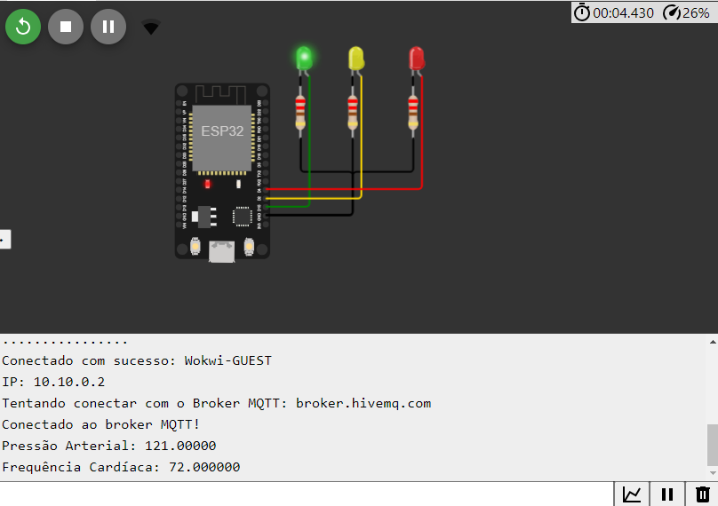
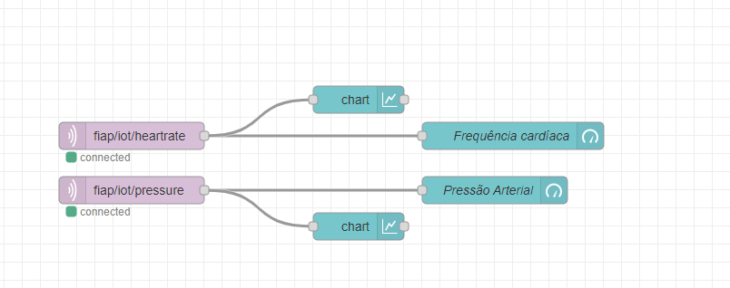
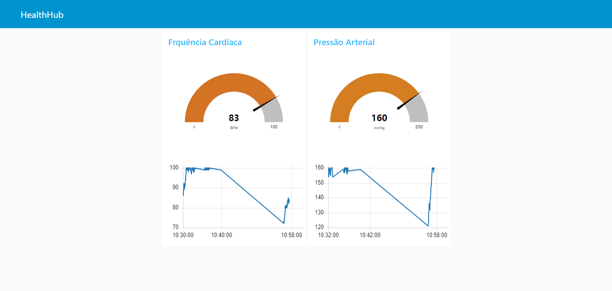

# VitaLink

VitaLink é um inovador hub de saúde conectado, projetado para promover o monitoramento contínuo e a gestão eficaz de dados vitais, incluindo pressão arterial e frequência cardíaca. Este dispositivo interage de forma inteligente com um aplicativo dedicado, proporcionando uma experiência personalizada e facilitando a promoção da saúde e bem-estar. Vitalink é a sua ponte para uma vida mais saudável, conectando você ao seu estado de saúde de forma intuitiva e acessível.

# Executando a aplicação:

## Físico 
- Esp32
- Led verde ligado no pino D15
- Led amarelo no pino D2
- Led vermelho no pino D4    
Após realizadas as conexões corretas basta rodar o codigo fonte presente no nosso repositório utilizando o Arduino IDE

## Simulador
Caso opte por usar o simulador, basta acessar o projeto no [WokWi](https://wokwi.com/projects/381742116298024961)   

# Imagens
   
   
   

